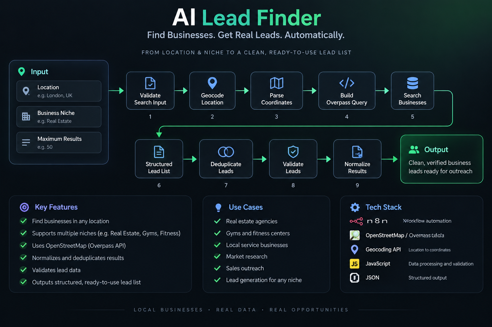

# AI Lead Finder

### Automated Business Lead Discovery & Data Preparation

**Built with n8n · OpenStreetMap · Overpass API · JavaScript · Webhooks · JSON**

AI Lead Finder is an automation workflow that discovers businesses based on a target location and niche, then processes the results into a clean, structured lead dataset.

The system is designed to automate the early stages of prospecting — turning a simple search request into normalized and deduplicated business records that can be passed into downstream sales or outreach workflows.

---

## Architecture



The workflow follows this pipeline:

```text
Location + Niche + Result Limit
              ↓
       Input Validation
              ↓
       Location Geocoding
              ↓
       Coordinate Parsing
              ↓
      Query Construction
              ↓
      Business Discovery
              ↓
      Result Normalization
              ↓
        Deduplication
              ↓
       Lead Validation
              ↓
      Structured Lead List
What Problem It Solves

Manual prospecting often requires repeatedly:

Searching for businesses in a target area
Filtering by niche
Collecting business information
Cleaning inconsistent results
Removing duplicates
Preparing data for outreach

AI Lead Finder automates this discovery and data-preparation layer.

Instead of manually searching and organizing businesses, an operator can provide:

Location
Niche
Maximum Results

and receive a structured list of discovered businesses.

How It Works
1. Search Input

The workflow accepts three primary inputs:

{
  "location": "London, UK",
  "niche": "real estate",
  "max_results": 10
}

These parameters determine where and what the workflow searches for.

2. Input Validation

The workflow validates the incoming search parameters before continuing.

This prevents invalid or incomplete requests from being passed into external services.

3. Location Geocoding

The requested location is converted into geographic coordinates.

Location
   ↓
Geocoding
   ↓
Latitude + Longitude

These coordinates are then used to construct the geographic business search.

4. Query Construction

The workflow dynamically builds a geographic search query based on the requested niche and location.

This allows the same automation to support different business categories rather than relying on a fixed search.

Examples include:

Real estate
Gyms
Fitness businesses
Other supported business categories
5. Business Discovery

The workflow queries business/location data using:

OpenStreetMap
Overpass API

The returned results are then passed through the processing pipeline.

6. Result Normalization

Business results can contain inconsistent structures and fields.

The workflow normalizes the returned data into a consistent structure so downstream systems can work with predictable fields.

Example:

{
  "name": "Example Property Group",
  "category": "Real Estate Agency",
  "address": "London, UK",
  "latitude": 51.5074,
  "longitude": -0.1278
}
7. Deduplication

Duplicate businesses are identified and removed before the final dataset is returned.

This prevents the same prospect from appearing multiple times in the output.

8. Lead Validation

The final results are checked before being returned.

The goal is to ensure the downstream system receives usable, structured business records rather than raw search data.

Output

The workflow produces a structured lead dataset containing information such as:

Business name
Business category
Address
Latitude
Longitude

The output can then be passed into other automation systems.

For example:

AI Lead Finder
      ↓
Clean Business Dataset
      ↓
AI Prospect Research
      ↓
AI Lead Qualification
      ↓
Personalized Outreach

This makes the workflow useful as a lead-discovery layer inside a larger sales automation system.

Why This Is More Than a Simple Scraper

The workflow does not simply retrieve raw search results.

It contains a processing pipeline:

DISCOVER
   ↓
NORMALIZE
   ↓
DEDUPLICATE
   ↓
VALIDATE
   ↓
STRUCTURE

This separation makes the output more useful for downstream automation.

The workflow can therefore act as an input layer for other systems such as CRM automation, prospect research, qualification, or outreach.

Technology Stack
Technology	Purpose
n8n	Workflow orchestration
OpenStreetMap	Geographic/business data
Overpass API	Business/location querying
JavaScript	Validation, transformation and data processing
Webhooks	Workflow input
JSON	Structured workflow data
Workflow Design

The automation is organized around several stages:

Input Layer

Receives:

Location
Niche
Maximum results
Validation Layer

Checks the search parameters before external requests.

Geographic Layer

Converts the requested location into coordinates.

Discovery Layer

Builds and executes the business search query.

Processing Layer

Normalizes and deduplicates returned businesses.

Validation Layer

Checks the final records before producing the output.

Repository Structure
ai-lead-finder/
│
├── README.md
│
├── architecture/
│   └── overview.png
│
├── workflows/
│   └── ai-lead-finder-sanitized.json
│
└── examples/
    ├── sample-input.json
    └── sample-output.json
Workflow File

The repository includes the sanitized n8n implementation:

workflows/ai-lead-finder-sanitized.json

The workflow is provided as a portfolio artifact so the automation architecture can be inspected directly.

Credentials and sensitive runtime information should not be included in the public repository.

Before deployment, configure the required services and environment-specific settings inside n8n.

Example Input & Output

Example workflow data is available in:

examples/sample-input.json
examples/sample-output.json

The examples demonstrate the expected structure without representing a claim of live search results.

Security

This repository is intended for demonstration and portfolio purposes.

When deploying the workflow:

Do not hard-code API keys
Use n8n credential management
Do not commit private credentials
Review external API configuration
Use appropriate webhook authentication
Replace example data with production data
Project Status

Status: Portfolio / Independent Project

This project was designed and built as an independent AI automation project to demonstrate practical capabilities in:

n8n workflow development
API integration
Geographic data processing
Business lead discovery
Data normalization
Deduplication
Input validation
Workflow orchestration
Automation architecture
What This Project Demonstrates

AI Lead Finder demonstrates how an automation can turn a simple business-search request into a structured dataset ready for downstream sales automation.

The core concept is:

Search → Process → Clean → Validate → Deliver

rather than manually performing each prospecting step.
